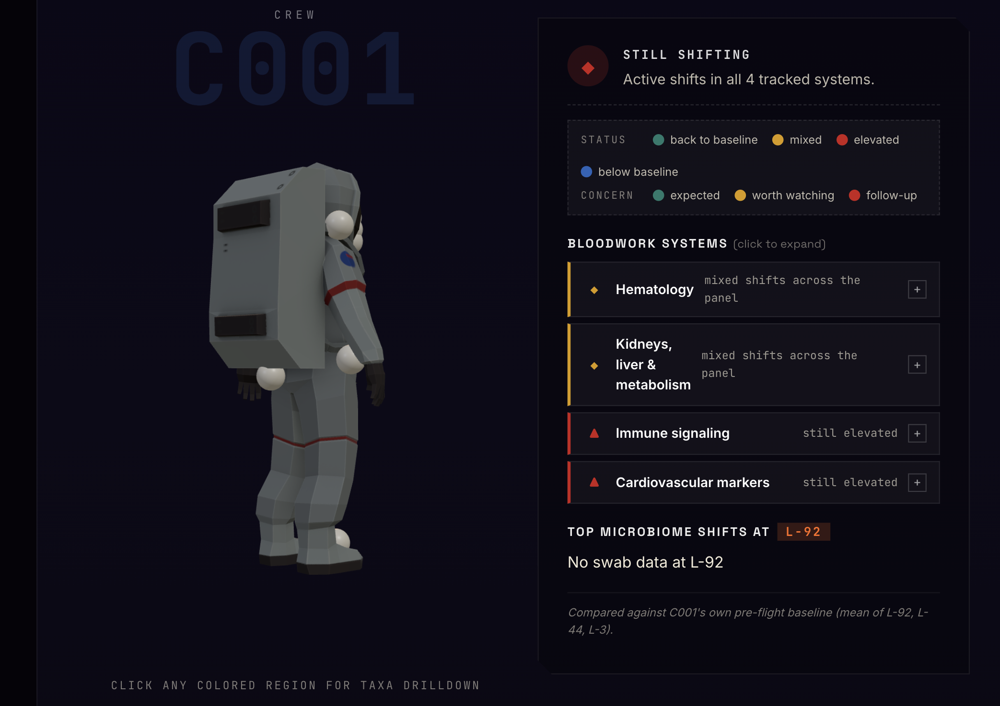

# Recovery, Honestly

> An astronaut-facing dashboard for the SpaceX Inspiration 4 mission.
> Per-crew bloodwork systems and a 3D body view of microbiome shifts, both wrapped in calibrated uncertainty.

**Track 3 · Communication & Visualization**
**2026 Torchlight Sovereignty Hackathon · The University of Austin**

Team: Earl, Thomas, Mollie. Built with substantial AI scaffolding (see [Use of AI](#use-of-ai)).
Live: <https://thomasolson1.github.io/TorchLight-Hackathon/>



Design philosophy: see [`docs/design-philosophy.md`](docs/design-philosophy.md).

---

## Summary

A single dark "character-select" hero where each crew member (C001–C004) is a tab. Switching tabs swaps a big rotating 3D astronaut whose anatomical hotspots are colored by Bray–Curtis distance from that astronaut's own pre-flight microbiome baseline, alongside a per-system bloodwork panel summarizing four sources (CBC, CMP, immune cytokines, cardiovascular markers). All scores compare each crew member to their own baseline; nothing pretends n=4 supports population claims.

## BioBrief

### 1. Background

Most published research on astronaut health is written for scientists, not astronauts. A returning crew member wants to know whether their bloodwork has recovered, when that recovery happened, *where on their body* something changed, and how much they should trust the answer when only four people have similar data. SpaceX's Inspiration 4 mission produced ~90% of all publicly available astronaut omics data — a rare resource for asking these questions, but with a small N that makes most population-level inference fragile.

### 2. Aim

Answer the astronaut's two-part question:

> *"Am I back to baseline, and where on me did things shift?"*

with rigorous uncertainty, no clinical claims, no false precision, and no implied population norms.

### 3. Data sources

| Dataset | Panel | What we use it for |
|---|---|---|
| [OSD-572](https://osdr.nasa.gov/bio/repo/data/studies/OSD-572) | Oral, nasal, and skin metagenomic swabs | Microbiome distance from each crew's pre-flight baseline at 10 body sites |
| [OSD-569](https://osdr.nasa.gov/bio/repo/data/studies/OSD-569) | Complete Blood Count | WBC differential, RBC line, platelets |
| [OSD-575](https://osdr.nasa.gov/bio/repo/data/studies/OSD-575) | Comprehensive Metabolic Panel | Renal, hepatic, glucose, electrolytes, proteins |
| [OSD-575](https://osdr.nasa.gov/bio/repo/data/studies/OSD-575) | Multiplex serum immune cytokines (Eve panel) | Pro-inflammatory + adaptive cytokine signatures |
| [OSD-575](https://osdr.nasa.gov/bio/repo/data/studies/OSD-575) | Multiplex serum cardiovascular markers (Eve panel) | Acute-phase + cardiac signals |

Crew identifiers (`C001 … C004`) are anonymized and **do not** correspond to the public mission roster order.

### 4. Methods

#### 4.1 Microbiome distance
- Source: `GLDS-564_GMetagenomics_Combined-gene-level-taxonomy-coverages-CPM_GLmetagenomics.tsv`.
- For each crew × body site, the three pre-flight swabs (`L-92`, `L-44`, `L-3`) form a personal baseline. Each non-baseline timepoint's relative-abundance vector is compared to the **mean** baseline vector via **Bray–Curtis distance**.
- 95% CI on the distance comes from a **bootstrap of the baseline samples** (resample with replacement, recompute the mean, recompute the distance — 1000 iterations, seeded RNG).
- A score is flagged `within_baseline_noise = true` when its distance is at or below the maximum pairwise Bray–Curtis distance among the same crew × site's baseline samples themselves.
- Top-5 species increases / decreases vs baseline are aggregated for the drilldown panel.
- Code: `analysis/microbiome_pipeline.py`, `analysis/shared/sample_parser.py`, `analysis/shared/bootstrap.py`.

#### 4.2 Bloodwork systems
- Sources combined into one `bloodwork.json` by `analysis/bloodwork_pipeline.py`: CBC long-form, CMP wide-form, two cytokine wide-form panels.
- Per crew × analyte, the trajectory band is set by a **bootstrap CI on each crew's pre-flight values**. The band communicates uncertainty about *the personal anchor*, not population variance.
- Reference ranges read directly from the source files' `RANGE_MIN` / `RANGE_MAX` columns where present.
- Per-crew, per-system, per-checkpoint summaries (R+1, R+45, R+82) classify each metric as `back_to_baseline`, `still_elevated`, `still_decreased`, or `mixed` based on whether the value falls inside or outside that crew's bootstrapped baseline CI.
- The L-3 → R+1 gap is preserved as a labeled break in any time-series; we never interpolate across the in-flight period.

#### 4.3 Curated annotation lists
Two small, citation-bearing JSON files flag specific species in the microbiome drilldown:
- [`dashboard/data/opportunists.json`](dashboard/data/opportunists.json) — ~21 species with literature-supported pathogenic potential.
- [`dashboard/data/beneficials.json`](dashboard/data/beneficials.json) — ~16 commensals with literature-supported protective effects.

In the drilldown a species is annotated:
- ⚠ caution — opportunist rising **or** beneficial falling
- ✓ favorable — beneficial rising **or** opportunist falling

Lists are conservative; absence of a badge does not mean a species is harmless or harmful, only that we did not have an evidence-based note to attach.

### 5. Findings

> **159 of 197 microbiome score cells (~81%) fall within each crew member's own pre-flight noise floor.**

The data itself says we cannot statistically distinguish most post-flight microbial shifts from each person's pre-existing ground-side variability. Personal microbiomes shift substantially even between L-92, L-44, and L-3 — and post-flight points often don't exceed that pre-existing personal range. This is a Track-3-relevant finding: loud claims about "spaceflight changes the microbiome" need to grapple with how much each individual's microbiome already varies day-to-day, *especially* with n=4 crew members.

Per-crew system summaries (auto-classified from the bloodwork pipeline) include patterns consistent with the literature — a transient post-landing red-cell-mass dip ("Spaceflight Anemia"), mild BUN/creatinine elevation on landing day attributable to dehydration, post-flight cytokine activity that normalizes by R+45 — but each is presented inside the per-crew tab so an astronaut sees their own trajectory, not a pooled mean.

### 6. Limitations and caveats

- **n = 4** makes any group-level claim fragile. Every figure communicates this via per-crew (not pooled) trajectories and a persistent honesty banner.
- **3 pre-flight baseline swabs per site** — bootstrap CIs are honest about the resulting wide bands. The drilldown explicitly notes that taxa rankings are noisy at this N.
- **No in-flight CBC** — blood draws happened before and after the mission, not during. The CBC trajectory has a deliberate, labeled gap between L-3 and R+1; we do not interpolate.
- **Color = "shifted," not "dangerous."** Bray–Curtis distance is direction-blind; a beneficial shift looks identical to a harmful one in the avatar color. Direction comes from the curated drilldown badges.
- **No clinical recommendations.** This is a research-data viewer, not a medical tool. Anything actionable should go through a flight surgeon.
- **Crew identifiers are randomized** — C001 … C004 do not correspond to the public mission roster order.

### 7. Reproducibility

```bash
git clone https://github.com/ThomasOlson1/TorchLight-Hackathon.git
cd TorchLight-Hackathon

# regenerate JSON from OSDR (pandas, numpy, scipy required)
python3 -m analysis.microbiome_pipeline   # -> dashboard/data/microbiome.json
python3 -m analysis.bloodwork_pipeline    # -> dashboard/data/bloodwork.json

# serve the dashboard locally
cd dashboard && python3 -m http.server 8000
# open http://localhost:8000
```

Each pipeline downloads the OSDR file on first run (cached to `data/raw/`, gitignored).
Bootstrap RNGs are seeded; pipeline output is byte-stable across runs.

The dashboard itself is a static site (no build step). It is deployed to GitHub Pages from `dashboard/` via [`.github/workflows/pages.yml`](.github/workflows/pages.yml).

### 8. Use of AI

Built with substantial use of an AI coding assistant (Claude Opus 4.7), under explicit team direction:

- **Human authorship** — project scope, what to cut (RNA-seq, KEGG/pathway/gene-family files, claim-check), the "color = shifted, not dangerous" framing, the decision to add bidirectional opportunist/beneficial annotation, editorial direction on the curated species lists, exploratory CBC notebook (Earl).
- **AI scaffolding** — frontend implementation (HTML/CSS/JS/SVG, the Three.js astronaut wiring), data pipeline structure, fixture data, color interpolation, bootstrap-CI utilities, JSON schema, README scaffolding.
- **Citation practice** — all literature citations in `opportunists.json` and `beneficials.json` reference real, verifiable papers. All methodological choices (Bray–Curtis, bootstrap CI from baseline, within-baseline-noise threshold, the per-system status classifier) are documented and defensible from the code.

We deliberately surface unflattering findings — including the result that ~81% of microbiome shifts cannot be statistically distinguished from each crew member's own ground-side variability — rather than overselling.

## Repository structure

```
analysis/
  shared/
    sample_parser.py        # OSD-572 sample-name canonicalization
    bootstrap.py            # bootstrap_ci, bootstrap_distance_ci
  microbiome_pipeline.py    # OSD-572 -> dashboard/data/microbiome.json
  bloodwork_pipeline.py     # OSD-569 + OSD-575 -> dashboard/data/bloodwork.json
dashboard/
  index.html                # static page
  app.js                    # ES module: hero stage, 3D body, drilldown, slider
  styles.css                # dark hero theme, character-select roster, panels
  assets/Astronaut.glb      # Google's CC-BY astronaut model (model-viewer asset)
  data/
    microbiome.json         # generated
    bloodwork.json          # generated
    opportunists.json       # curated literature-flagged opportunist list
    beneficials.json        # curated literature-flagged beneficial list
    fixture-*.json          # frozen fixtures used during parallel frontend dev
data/raw/                   # gitignored - pipelines fetch on first run
docs/superpowers/
  specs/                    # design spec
  plans/                    # implementation plan
notebooks/                  # exploratory notebooks (Earl's CBC exploration)
.github/workflows/pages.yml # auto-deploy dashboard/ to GitHub Pages
```

## Data attribution

- [OSD-572](https://osdr.nasa.gov/bio/repo/data/studies/OSD-572) — Inspiration 4 oral, nasal, and skin metagenomic microbial swabs.
- [OSD-569](https://osdr.nasa.gov/bio/repo/data/studies/OSD-569) — Inspiration 4 whole blood profiling (CBC sub-panel).
- [OSD-575](https://osdr.nasa.gov/bio/repo/data/studies/OSD-575) — Inspiration 4 serum metabolic panel + immune & cardiovascular cytokine panels.
- Astronaut 3D model: Google's [`<model-viewer>`](https://modelviewer.dev/) sample (`Astronaut.glb`), CC BY 4.0.

Data made publicly available through NASA's Open Science Data Repository.
